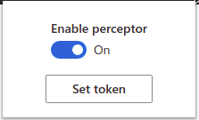
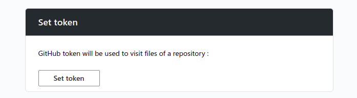
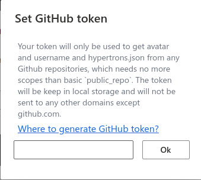
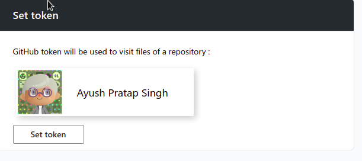

Language : US | [zh-CN](./INSTALLATION.zh-CN.md)

# Installation Guide

We welcome users to install and try our Hypertrons Chrome Extension. If you have any feedback, please post it in the [issue area](https://github.com/hypertrons/hypertrons-crx/issues) (with description of the problem and browser configurations). We will actively respond and solve it!

## Install from Chrome Web Store

### Chrome / Edge

1. [Chrome] Visit [Chrome Web Store](https://chrome.google.com/webstore/detail/hypercrx/ijchfbpdgeljmhnhokmekkecpbdkgabc)，and click **[Add to Chrome]**.

1. [Edge] Visit [Edge Extensions Home](https://microsoftedge.microsoft.com/addons/detail/hypercrx/lbbajaehiibofpconjgdjonmkidpcome?hl=zh-CN), and click **[Get]**.

<table> 
   <thead> 
     <tr> 
       <th width="33%">项目关系网络图</th> 
       <th width="33%">项目活跃开发者协作网络图</th> 
       <th width="34%">项目活跃度&影响力趋势图</th> 
     </tr> 
   </thead> 
   <tbody> 
     <tr> 
       <td> 
          
       </td> 
       <td> 
          
       </td> 
       <td>
          </td>
     </tr> 
   </tbody> 
 </table> 

2. Then you can find the dashboards in:

<table>
  <thead>
    <tr>
      <th width="50%">Entrance 1: GitHub User's Profile Page</th>
      <th width="50%">Entrance 2: GitHub Repository Page</th>
    </tr>
  </thead>
  <tbody>
    <tr>
      <td>
        
      </td>
      <td>
        
        
      </td>
    </tr>
  </tbody>
</table>

3. You can change configuration of hypertrons-crx by visiting the setting page:

<table> 
   <thead> 
     <tr> 
       <th width="50%"> If Chrome</th> 
       <th width="50%">If Edge</th> 
     </tr> 
   </thead> 
   <tbody> 
     <tr> 
       <td> 

       </td> 
       <td>

              </td>
     </tr> 
   </tbody> 
 </table> 

## Install from released package

The latest release can be found on this page https://github.com/hypertrons/hypertrons-crx/releases , where `hypertrons.crx` and `hypertrons.zip` are available under `Assets`. Currently, the extension can be installed to multiple browsers that use the chromium kernel. Some common ones are listed as follow:

- [Chrome](#chrome)

- [Edge](#edge)

- [360 Safety Explorer](#360-safety)

- [360 Speed Explorer](#360-speed)

## <a id="chrome">Chrome </a>

1. Download file `hypertrons.zip`, and unzip it to a new folder, for example, named as `hypertrons/`.

2. Open Chrome browser and enter [chrome://extensions](chrome://extensions) in the address bar directing to the extension management page.

3. Turn on the **[Developer Mode]** button on the top right corner of this page, then refresh.

4. Click **[Load Unpacked]** button on the top left, and select the folder where the unzipped files are stored( `hypertrons/`).

5. Now, the extension can be successfully loaded. Make sure the switch is on.

## <a id="edge">Edge</a>

1. Download file `hypertrons.zip`, and unzip it to a new folder, for example, named as `hypertrons/`.

2. Open Edge and enter [edge://extensions/](edge://extensions/) in the address bar directing to the extension management page.

3. Turn on the **[Developer Mode]** button on the bottom left corner of this page, then refresh.

4. Click **[Load Unpacked]** button on the top right, and select the folder (`/build`) under the folder ( `hypertrons/`) unzipped in step 1.

5. Now, the extension can be successfully loaded. Make sure the switch is on.

## <a id="360-safety"> 360 Safety Explorer</a>

1. Download file `hypertrons.crx`.

2. Open the browser and enter [se://extensions/](se://extensions/) in the address bar directing to the extension management page.

3. Turn on the **[Developer Mode]** button on the top right corner of, and then refresh.

4. Drag the downloaded file `hypertrons.crx` into this page.

5. In the pop-up dialog box "Do you want to add Hypertrons?", select **[Add]**.

6. Now, the extension can be successfully loaded. Make sure the switch is on.

## <a id="360-speed"> 360 Speed Explorer

1. Download file `hypertrons.crx`.

2. Open the browser and enter [chrome://myextensions/extensions](chrome://myextensions/extensions) in the address bar directing to the extension management page.

3. Turn on the **[Developer Mode]** button on the top right corner of, and then refresh.

4. Drag the downloaded file `hypertrons.crx` into this page.

5. In the pop-up dialog box "Do you want to add Hypertrons?", select **[Add]**.

6. Now, the extension can be successfully loaded. Make sure the switch is on.

# Additional Configuration

### Adding Github Token

Hypertrons requires a github token for getting the avatar and username from Github repositories and getting the hypertrons.json.

1. Click on the hypertrons icon to open the menu and select set Token

2. Now click on set Token in the Options page

3. You'll need a github token with "public_repo" scope. <a href="https://docs.github.com/en/github/authenticating-to-github/keeping-your-account-and-data-secure/creating-a-personal-access-token">How to generate token?</a>

4. Paste the token and click ok

