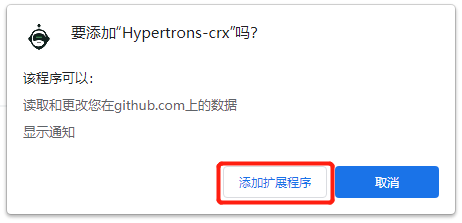
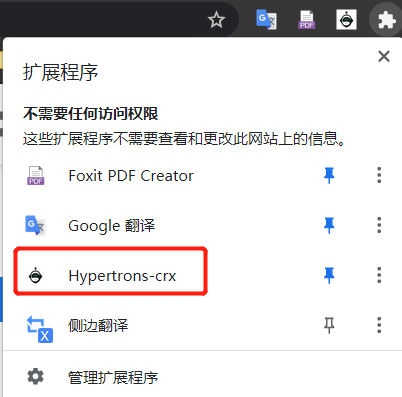
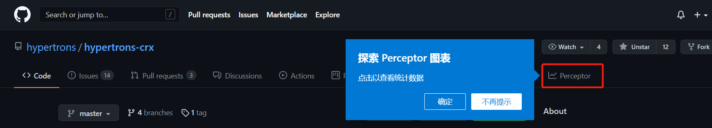
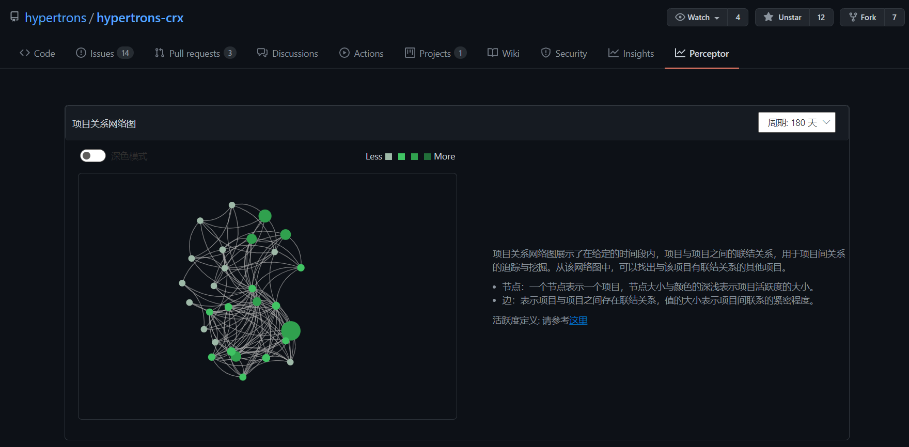

Hypertrons-crx v1.0.0 现已登陆 Chrome 网上应用商店，您可以通过本文档，了解如何在 Chrome 浏览器中安装并使用 Hypertrons-crx，具体步骤如下：

## Step 1：

在 Chrome 网上应用商店中搜索“Hypertrons-crx”，或点击以下链接(https://chrome.google.com/webstore/detail/hypertrons-crx/jkgfcnkgfapbckbpgobmgiphpknkiljm/related) 访问“Hypertrons-crx”的插件页面。

点击“添加至 Chrome”，并确认“添加扩展程序”，经过短暂的等待， Hypertrons-crx 将会被成功添加至扩展程序，点击浏览器右上角拼图样式的扩展程序管理，可看到已经安装成功的扩展程序。

 

  

  

 

## Step 2：

插件成功添加后，我们访问 GitHub 的任一仓库，这里以hypertrons/hypertrons-crx (https://github.com/hypertrons/hypertrons-crx) 为例，网页中将会出现新的 Perceptor 栏目（若未出现，可尝试刷新网页），点击该栏目，可以看到 hpertrons-crx 的项目关系网络图和项目活跃开发者协作网络图。

 

  

 

 

## Step 3（可选）：

在浏览器右上角的产检管理器中，点击插件名称，将进入 Hypertrons-crx 的设置页面，您可在这里选择想要查看的组件类别，图表类型以及确认是否自动检测更新。

 

 

 

以上是 Chrome 浏览器安装 Hypertrons-crx 的简要说明，若您在安装和使用过程中有任何问题和建议，可访问项目的 issue列表 (https://github.com/hypertrons/hypertrons-crx/issues) 创建您的 isuue 与我们进行讨论。

感谢您的支持！

