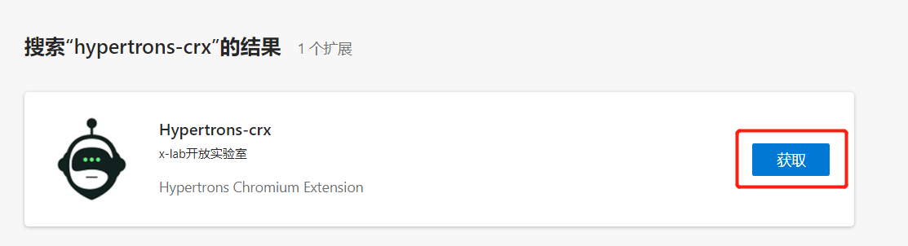
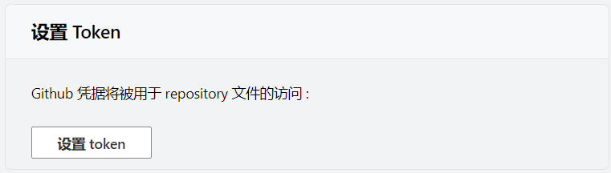
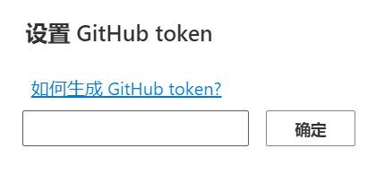
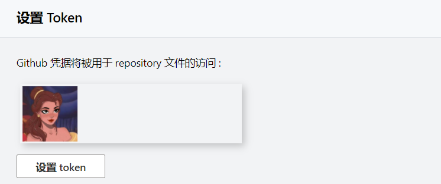

Language : [US](./INSTALLATION.md) | zh-CN

# 安装指南

欢迎下载安装 hypertrons-crx 浏览器插件。您可以通过本文档，了解如何下载安装并使用 Hypertrons-crx。如果您在插件使用过程中遇到任何问题，欢迎 [提 Issue](https://github.com/hypertrons/hypertrons-crx/issues) 反馈给我们！

您可以任选一种方式安装使用。

## 从应用商店安装

Hypertrons-crx 现已登陆 [Chrome 网上应用商店](https://chrome.google.com/webstore/detail/hypercrx/ijchfbpdgeljmhnhokmekkecpbdkgabc)及[Edge 网上扩展商店](https://microsoftedge.microsoft.com/addons/detail/hypercrx/lbbajaehiibofpconjgdjonmkidpcome?hl=zh-CN)。

### Chrome 浏览器 / Edge 浏览器

1. [Choreme]点击 [此链接](https://chrome.google.com/webstore/detail/hypercrx/ijchfbpdgeljmhnhokmekkecpbdkgabc) 访问 “Hypercrx” 扩展程序主页，点击 “添加至 Chrome” ，并确认。

1. [Edge]点击[此链接](https://microsoftedge.microsoft.com/addons/detail/hypercrx/lbbajaehiibofpconjgdjonmkidpcome?hl=zh-CN) 访问 “Hypercrx” 扩展程序主页，点击 “获取” ，在网页弹窗中点击 “添加扩展” ，当浏览器右上角出现 “Hypercrx” 图标，即表示安装完成。

2. 此时插件已成功安装，您可以在 GitHub 任一开发者/仓库主页面看到以下效果图：

<table>
	<tr>
		<th width="50%">
			
Entrance 1: GitHub User's Profile Page
			

			

		<th width="50%">
			
Entrance 2: GitHub Repository Page
			

			

</table>

3. 如需对插件进行设置，请点击以下按钮，可以进入到插件设置页面。在设置页面，您可以更改相关配置。

<table>
	<tr>
		<th width="50%">
      
 Chrome 浏览器
      
 
		<th width="50%">
			
 Edge 浏览器
      
 
</table>

## 手动下载安装包

您可以在[这里](https://github.com/hypertrons/hypertrons-crx/releases)下载最新的安装包。 当前版本支持 Chromium 内核浏览器，如:

- [Chrome 浏览器](#chrome)

- [Edge 浏览器](#edge)

- [360 安全浏览器](#360-safety)

- [360 快速浏览器](#360-speed)

###  Chrome 浏览器

1. 下载 `hypertrons.zip`, 解压。

2. 打开浏览器，在地址栏中输入 [chrome://extensions](chrome://extensions)。

3. 打开 **[开发者模式]**。

4. 点击 **[加载已解压的扩展程序]**。

5. 完成。

###  Edge 浏览器

1. 下载 `hypertrons.zip`, 解压。

2. 打开浏览器，在地址栏中输入 [edge://extensions/](edge://extensions/)。

3. 打开 **[开发者模式]**。

4. 点击 **[加载已解压的扩展程序]**，选择第 1 步解压的文件夹下的 `build` 文件夹。

5. 完成。

### <a id="360-safety"> 360 安全浏览器

1. 下载 `hypertrons.crx`.

2. 打开浏览器，在地址栏中输入 [se://extensions/](se://extensions/)。

3. 打开 **[开发者模式]**。

4. 将下载好的 `hypertrons.crx` 拖入页面中。

5. 弹框选择 **[添加]**。

6. 完成。

### <a id="360-speed">360 快速浏览器

1. 下载 `hypertrons.crx`.

2. 打开浏览器，在地址栏中输入 [chrome://myextensions/extensions](chrome://myextensions/extensions)。

3. 打开 **[开发者模式]**。

4. 将下载好的 `hypertrons.crx` 拖入页面中。

5. 弹框选择 **[添加]**。

6. 完成。

## 附加配置

### 添加 GitHub token

Hypertrons 需要一个 GitHub token 来从 GitHub 仓库中获取用户信息，以得到 hypertrons.json 文件。

1. 右键 hypertrons 图标，进入“选项”，打开设置菜单，并选择“设置 token”；

2. 在弹出的页面中粘贴您已经生成的 token,<a href="https://docs.github.com/en/github/authenticating-to-github/keeping-your-account-and-data-secure/creating-a-personal-access-token">如何生成 token?</a>

3. 粘贴您的 token 后，点击“确定”，您的 token 将会被应用。
   

以上是 Hypertrons-crx 的安装及使用说明，若您在安装和使用过程中有任何问题和建议，可访问项目的 issue 列表 (https://github.com/hypertrons/hypertrons-crx/issues) 或创建 isuue 与我们进行讨论。

感谢您的支持！
