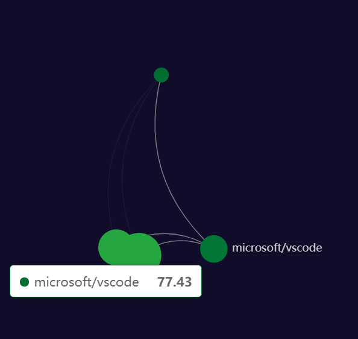

Language : [US](./README.md) | CN

<h1 align="center">Hypertrons Chrome Extension</h1>

<div align="center">

开源项目与开发者关系的追踪、挖掘与洞察

[](https://cla-assistant.io/hypertrons/hypertrons-crx)

</div>

Hypertrons 浏览器插件项目旨在通过直接往 GitHub 页面中插入各类可视化看板的形式，帮助用户快速追踪、挖掘和洞察项目与开发者的各类行为数据，为社区的数字化运营和分析提供有效支撑。

## 可视化看板 🔥🔥🔥

<table>
	<tr>
		<th width="50%">
			<p> 项目关系网络图
			<p>
		<th width="50%">
			<p>项目活跃开发者协作网络图
			<p>
	<tr>
	<tr>
		<th width="50%">
			<p>开发者协作网络图
			<p>
		<th width="50%">
			<p>开发者活跃仓库网络图
			<p>
</table>

### 项目关系挖掘 🎉

- **项目关系网络图**: 项目关系网络图展示了在给定的时间段内，项目与项目之间的联结关系，***用于项目间关系的追踪与挖掘***。从该网络图中，可以找出与该项目有联结关系的其他项目。

- **项目活跃开发者协作网络图**: 项目活跃开发者协作网络图展示了在给定的时间段内，项目内部活跃的开发者之间的协作关系，***用于项目内部开发者关系的追踪与挖掘***。从该网络图中，可以找出该项目中最活跃的开发者，及开发者之间的协作关系。

### 开发者关系挖掘 🎉

- **开发者协作网络图**: 开发者协作网络图展示了在给定的时间段内，开发者与开发者之间的协作关系, ***用于开发者关系的追踪与挖掘***。从该网络图中，可以找出与指定失误开发者联系较为紧密的其他开发者。
- **活跃仓库网络图**: 活跃仓库网络图展示了在给定的时间段内，开发者的活跃项目，***用于开发者行为的追踪与挖掘***。从该网络图中，可以找出该开发者在哪些项目中活跃。

## 安装与使用 📢

[link-chrome]: https://chrome.google.com/webstore/detail/hypertrons/jkgfcnkgfapbckbpgobmgiphpknkiljm 'Version published on Chrome Web Store'

[][link-chrome] [][link-chrome] also compatible with [][link-chrome] [][link-chrome]

更多信息请参考 [安装指南](./INSTALLATION.md).

## 参与贡献

### 快速开始

```bash
git clone git@github.com:hypertrons/hypertrons-crx.git
cd hypertrons-crx
npm install
npm run watch
npm run web-ext
```

[web-ext](https://github.com/mozilla/web-ext) 将会自动打开 `Chrome` 浏览器并加载 `Hypertrons-crx`. `web-ext` 的配置请参考 [package.json](https://github.com/hypertrons/hypertrons-crx/blob/master/package.json):

```json
{
  "webExt": {
    "sourceDir": "distribution",
    "run": {
      "keepProfileChanges": true,
      "chromiumProfile": "./test/web-ext-profile",
      "startUrl": ["https://github.com/hypertrons/hypertrons-crx"]
    }
  }
}
```

### 问题交流

我们非常欢迎您的贡献，您可以通过 [Issue](https://github.com/hypertrons/hypertrons-crx/issues) 提出问题或交流。

更多信息请参考 [贡献指南](./CONTRIBUTING.md).
