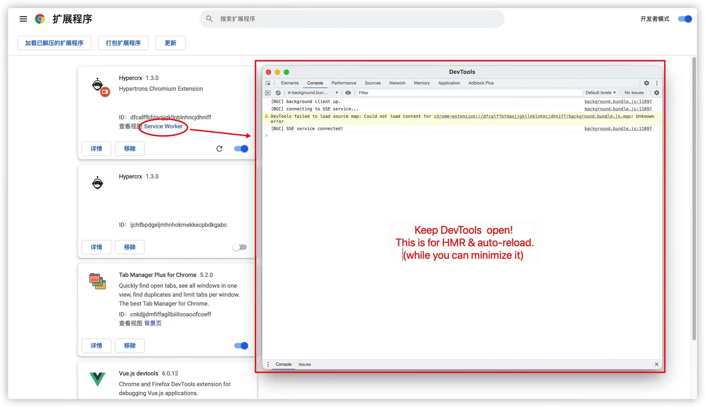

Language : [US](./README.md) | zh-CN

<h1 align="center">Hypertrons Chrome Extension</h1>

开源项目与开发者关系的追踪、挖掘与洞察

Hypertrons 浏览器插件项目旨在通过直接往 GitHub 页面中插入各类可视化看板的形式，帮助用户快速追踪、挖掘和洞察项目与开发者的各类行为数据，为社区的数字化运营和分析提供有效支撑。

## 可视化看板 🔥🔥🔥

您可以在以下入口处找到这些看板：

<table>
	<tr>
		<th width="50%">
			
Entrance 1: GitHub User's Profile Page
			

		<th width="50%">
			
Entrance 2: GitHub Repository Page
			

</table>

### 项目关系挖掘

<table>
	<tr>
		<th width="50%">
			
 项目关系网络图
			

		<th width="50%">
			
项目活跃开发者协作网络图
			

</table>

- **项目关系网络图**: 项目关系网络图展示了在给定的时间段内，项目与项目之间的联结关系，**_用于项目间关系的追踪与挖掘_**。从该网络图中，可以找出与该项目有联结关系的其他项目。

- **项目活跃开发者协作网络图**: 项目活跃开发者协作网络图展示了在给定的时间段内，项目内部活跃的开发者之间的协作关系，**_用于项目内部开发者关系的追踪与挖掘_**。从该网络图中，可以找出该项目中最活跃的开发者，及开发者之间的协作关系。

### 开发者关系挖掘

<table>
	<tr>
		<th width="50%">
			
开发者协作网络图
			

		<th width="50%">
			
开发者活跃仓库网络图
			

</table>

- **开发者协作网络图**: 开发者协作网络图展示了在给定的时间段内，开发者与开发者之间的协作关系, **_用于开发者关系的追踪与挖掘_**。从该网络图中，可以找出与指定开发者联系较为紧密的其他开发者。
- **活跃仓库网络图**: 活跃仓库网络图展示了在给定的时间段内，开发者的活跃项目，**_用于开发者行为的追踪与挖掘_**。从该网络图中，可以找出该开发者在哪些项目中活跃。

## 安装与使用 📢

[link-chrome]: https://chrome.google.com/webstore/detail/hypertrons-crx/jkgfcnkgfapbckbpgobmgiphpknkiljm "Version published on Chrome Web Store"

[][link-chrome] [][link-chrome] also compatible with [][link-chrome] [][link-chrome]

更多信息请参考 [安装指南](./INSTALLATION.zh-CN.md).

## 参与贡献

如果你初来乍到或对 Git/GitHub 的基本操作不熟悉，请阅读[CONTRIBUTING](./CONTRIBUTING.md)。

### 快速开始

1. git clone https://github.com/hypertrons/hypertrons-crx

2. cd hypertrons-crx

3. yarn install

4. yarn run start

5. 在 chrome 中加载新鲜出炉的插件:

   1. 在浏览器地址栏访问 chrome://extensions/

   2. 勾选“开发者模式”

   3. 点击“加载已解压的扩展程序”

   4. 选择项目根目录下的“build”目录

   5. 保持“Service Worker”的 DevTools 页面为打开状态 ([why?](https://github.com/hypertrons/hypertrons-crx/pull/274#discussion_r811878203))

      

6. Happy hacking!

### HMR & auto-reload

如果你开发的是 Options 页面或 Popup 页面，每次保存文件都可以让页面进行热模块替换而不需要刷新页面，这意味着你能立马看到改动后的效果。

但是，如果你开发的是 Background 或 ContentScripts，每次保存文件后，service worker 会自动重新加载插件。除此之外，若你开发的是 ContentScripts，那么那些被注入 ContentScripts 的页面还会自动刷新从而运行最新的 ContentScripts。

### 问题交流

我们非常欢迎您的贡献，您可以通过 [Issue](https://github.com/hypertrons/hypertrons-crx/issues) 提出问题或交流。

更多信息请参考 [贡献指南](./CONTRIBUTING.md).
